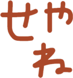
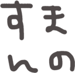

# slack-handwrite-emoji

Handmade handwrite Slack Emoji

スマホアプリでちまちま作ってきたSlack用絵文字を配布します。





うごくよ


# 使い方
2種類あります。

- 画像をダウンロードして、Chrome拡張機能をつかってSlackに登録する（GUI）
- YAMLファイルをダウンロードして、Emojipacksというライブラリを使ってSlackに登録する（CLI）

## 画像をダウンロード

ソースをクローンして、画像をダウンロードします。

```
$ git clone https://github.com/mizukichandayo/slack-handwrite-emoji.git
```


こちらのChrome拡張機能をつかって一括アップロードします。  

[https://chrome.google.com/webstore/detail/neutral-face-emoji-tools/anchoacphlfbdomdlomnbbfhcmcdmjej](https://chrome.google.com/webstore/detail/neutral-face-emoji-tools/anchoacphlfbdomdlomnbbfhcmcdmjej)

## Emojipacksをつかって登録

以下からお好きなYAMLをダウンロードし、こちらのライブラリをつかってSlackに登録してください。  
[https://github.com/lambtron/emojipacks](https://github.com/lambtron/emojipacks)  

全部入り以外のファイルには、重複する絵文字は含まれません。  
つまりall以外を全部Slackに登録するのとallを登録するのは同じ意味です。  

### Emojipacks

全部入りです。いろいろ選ぶのがめんどくさいときはこれをどうぞ。  
[all](./emojipacks/all.yml)  

使いやすそうなものを集めました。  
[basic](./emojipacks/basic.yml)  

エンジニアの人たちがよく使う言葉を集めました。  
[engineer](./emojipacks/engineer.yml)  

英語です。TGIFとか  
[english](./emojipacks/english.yml)  

イラストです。フルーツとか、乗り物とか  
[illustration](./emojipacks/illustration.yml)  

記号です。マジ卍  
[kigou](./emojipacks/kigou.yml)  

数字です。  
[number](./emojipacks/number.yml)  

おみくじ用です。  
[omikuji](./emojipacks/omikuji.yml)  

季節の言葉やイラストです。  
[seasonnal](./emojipacks/seasonnal.yml)  

ちょっと使うシチュエーションを選びそうなものを集めました。  
（どこにも含まれなかったとも言います）  
[motto](./emojipacks/motto.yml)  

# Buy me a coffee!

よかったら投げ銭をおねがいします  
[Buy me a coffee :)](https://www.buymeacoffee.com/mizukichandayo)  

